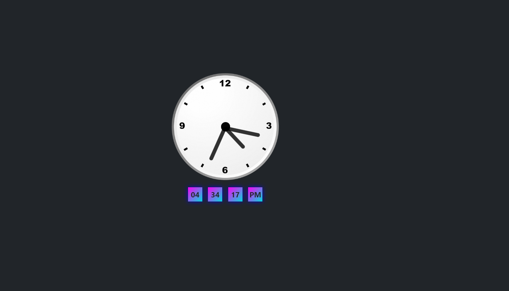

# Analog and Digital Clock



## Introduction

Welcome to the Analog and Digital Clock Project! This repository hosts a beautiful web application that combines the timeless elegance of analog clocks with the precision of digital timekeeping.

## Features

- **Analog Clock**: A stunning analog clock that displays the current time with classic charm.

- **Digital Display**: A digital time display provides an exact time reading for those who prefer precision.

- **Responsive Design**: The project is optimized for various devices, ensuring it looks fantastic on desktop and mobile.

- **Real-Time Updates**: The clock updates in real-time to keep you perfectly synchronized.

## Technologies Used

- **HTML5**: Utilized for structuring the web page's content.

- **CSS3**: Responsible for styling the clock, ensuring an attractive visual design.

- **JavaScript**: Powers the dynamic functionality, enabling real-time updates and interactivity.

## Demo

To experience the project, simply click [here](https://github.com/iMamoonAkhter/Analog-and-Digital-Clock).

## Installation

To run the project locally, follow these steps:

1. Clone this repository:
   ```shell
   git clone https://github.com/iMamoonAkhter/Analog-and-Digital-Clock.git
